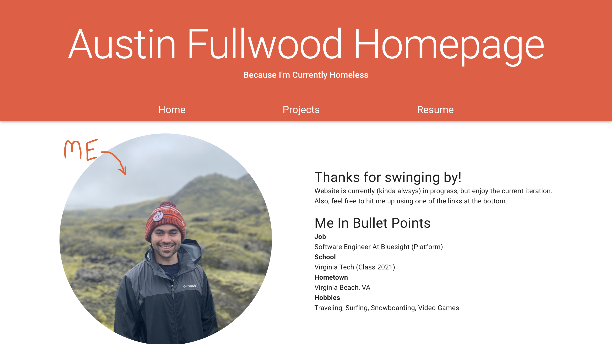

<div align="center">



<h3>Homepage</h3>

The repo that holds my homepage, [www.austinfullwood.com](www.austinfullwood.com). It's a crappy, little homepage, but it's my crappy, little homepage.

</div>

## Overview

I believe a homepage is a developer's self portrait, so I hope to one day make this a perfect representation of myself. That is very much not the case at the moment

Till then, this is a living website that I'll make incremental improvements on until I feel satisfied with the outcome.

Apologises if you visit it. It's very slow for no reason.

## Getting Started

Install [nvm](https://github.com/nvm-sh/nvm) before proceeding.

Install dependencies:
```
npm install
```

Run the applicaton:
```
npm start
```

## Deploy

Once code is pushed to the repo, it is automatically deployed to the production [website](www.austinfullwood.com).

To deploy the backend:
```
amplify push
```
